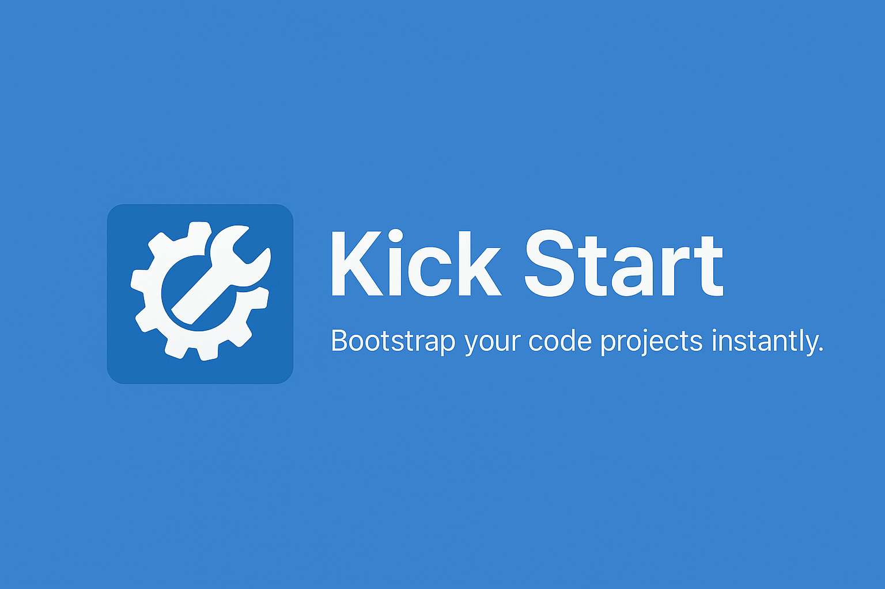

<p align="center">
  
</p>

<h1 align="center">Kick Start</h1>

<p align="center"><b>Jumpstart your coding projects — across multiple languages, with zero setup friction.</b></p>

<p align="center">
  
  
  
</p>


---


## 🚀 What is Kick Start?

**Kick Start** is a lightweight tool that automates boilerplate creation, structure setup, and build script generation for new coding projects — so you can focus on writing code, not configuration.

Whether you're starting in **C, C++, Java, Python, or Rust**, Kick Start gives you a clean, ready-to-run foundation in seconds.

---

## ✨ Features

- 🔧 **Multi-Language Templates**  
  Prebuilt templates for **C, C++, Java, Python, Rust**, and more.

- 🛠 **Build Script Generator**  
  Generates `Makefile`, `setup.py`, or batch/shell scripts automatically.

- 📦 **Library Manager**  
  Handles `libs/` folder, fetches dependencies, and tracks them via `.json` metadata.

- 🧱 **Scaffolded Project Structure**  
  Each project includes:
    ```
    /src        → main source file
    /build      → compiled binaries
    libs/       → managed dependencies
    .gitignore
    README.md
    ````

- 📄 **File Headers**  
Author, license, and version comments auto-added to main files.

- 🧠 **Compiler Detection**  
Checks if compilers are installed; provides install links if not.

- 🔌 **Custom Templates & Licenses**  
Easily create and share your own reusable templates.

- 🧰 **Git Integration**  
Auto-inits a Git repo, creates first commit, and links to remotes.

- ⚙ **Config Files**  
- `project.json` — project metadata (portable across GitHub/GitLab/Bitbucket)  
- `package.json` — Node-style dependencies and metadata

---

## 📸 Screenshots & Examples

> *[Optional: Replace below image paths once you have screenshots]*

- 📁 *Example generated project structure:*  


- 🖥️ *CLI workflow example:*  


---

## 📚 Getting Started

> ⚠️ **Warning:** Some templates are incomplete. Please refer to working `lang.json` files as examples.

### 🔻 Download

```bash
git clone https://github.com/KingVentrix007/KickStart.git
cd KickStart
````

### 🧱 Build

#### For Testing:

```bash
make        # Builds debug version into /tests
make run    # Runs the debug version
```

#### For Production:

```bash
make build  # Builds release version
./kpm <init|template|install|run|build|langs|count> [package]
```

Follow the interactive prompts and you’re good to go.

📖 Need help? See the [Wiki](docs/home.md)

---

## 🛣️ Roadmap

Planned features:

* ✅ Custom template & license support
* 🔄 Revamped library builder
* 🧰 Cross-language build runner (like `npx`)
* 🐞 Debugger integrations for GDB, LLDB, PDB, etc.
* 📦 OS/Web/Chat project templates

See [ROADMAP.md](ROADMAP.md) for full list.

---

## 🧪 Known Limitations

* `./kpm install` only works for C and package-managed languages.
* Templates for some languages are incomplete.
* Only basic validation currently; more error handling in future releases.

---

## 🤝 Contributing

Contributions, feature requests, and bug reports are welcome!
Please see the [CONTRIBUTING.md](CONTRIBUTING.md) guide.

---

## 📄 License

This project is licensed under the [MIT License](LICENSE).

---

<p align="center">
  <i>Kick Start — Build the base. Ship the future.</i>
</p>
```


